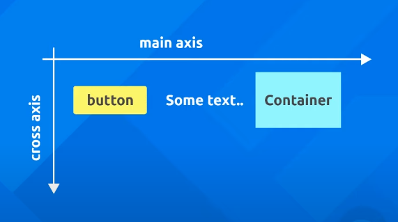

# Dart Language

Dart is a OOP as python or others, to create classes and function

This code create the main function (the function that it is call when run the code), and a class User (The blue print, the thing that describes the user object)

- The class User has two attributes and one method. This attributes until now are fix
- In the main function, the first 'User' dictate what variable type we are creating 'userOne' and we invoke the User() as like it was a function storing it in a variable 'userOne' (creating the object userOne)

```dart
void main() {
  User userOne = User();
  print(userOne.username)
}

class User {
  String username = 'mario';
  int age = 25;

  void login () {
    print('User logged in')
  }
}
```

We can overwrite the behavior of the class by creating a constructor, and this constructor has to has the same name as the class it self 'User()'
- Inside the constructor we take the two parameters username and age, so when we create the user object we pass those arguments and create the User inside the constructor.
  - We need to define this parameters (they don't have to has the same name as the variable declared before)
  - This parameters are passed to the constructor from the creation of the object in the main function.
  - Now we can pass inside the constructor the values of the arguments that it takes to the variables of the class User


```dart
void main() {
  User userOne = User('luigi', 25);
  print(userOne.username);
  print(userOne.age);

  userOne.login()
}

class User {

  String username;
  int age;

  User(String username, int age) {
    this.username = username;
    this.age = age;
  }

  void login() {
    print('User logged in')
  }

}
```

Now we can create a SuperUser class that are going to inherit the behavior of the class User and add another method that for some reason we don't want that the User class has. (So it extends from the User class)
- The first thing it is create the extra function 'publish'
- We have to create the constructor for the SuperUser class
  - But not like the User, we don't set the values that we pass to the SuperUser as arguments inside this constructor, we inherit from the User which has those values. So we need to call 'super' which call the constructor from the User class and pass those values in.


```dart
void main() {
  User userOne = User('luigi', 25);
  print(userOne.username);
  print(userOne.age);
  userOne.login()

  SuperUser userTwo = SuperUser('mario', 30)
  print(userTwo.username);
  print(userTwo.age);
  userTwo.login()
  userTwo.publish()

}

class User {

  String username;
  int age;

  User(String username, int age) {
    this.username = username;
    this.age = age;
  }

  void login() {
    print('User logged in')
  }
}

class SuperUser extends User {

  SuperUser(String username, int age) : super(username, age);

  void publish() {
    print('Publish Update')
  }
}
```

# Creating the Flutter app

First of all install the Flutter extension for VSCode. Have a simple tutorial into how setting up everything in the VSCodein the main page of FLutter 'https://flutter.dev/docs/get-started/editor?tab=vscode'.

We have to install the Android Studio to be able to create the emulator. I created an Nexus 6 emulator from it, and in the vscode we can start it from the small bar bellow, or if it is not showing there, type in the command line.

```cmd
flutter emulator

<!-- See all the devices that we have install -->

flutter emulators --launch <emulator id>
```

Now everything are inside the vscode so we don't need to run with terminal anymore.

# Scaffold & AppBar Widgets:

Delete everything inside the main.dart file and let start from the beginning

- We are going to use the MaterialApp widget as our root widget

```dart
import 'package:flutter/material.dart';

void main() {
  runApp();
}
```

### MateriaApp widget:

The MaterialApp widget allow us to create a blank app and use Google Material Design features (https://material.io/design) inside this application. Like a wrapper for the rest of our widgets
- Properties:

  1. home: it is going to be a Text() widget from now


```dart
void main(){
  runApp(MaterialApp(
    home: Text('Hello World')
  ));
}
```

So now lets start to add more widget to our application

### Scaffold Widget:

Allow us to implement a basic layout to our app.

- Properties:

  1. appBar: specify how our appBar it going to look at the top. The value of this property are going to be another widget call AppBar
  
  2. body: We need to place the text of our body in the center of the page the Center() widget
    - We always have to has properties inside the widgets, so we cannot put the text directly, we need the 'child' property. This is use when we nest something directly inside another widget
  
  3. floatingActionButton: The value of this property it going to be again a widget call 'FloatingActionButton()' 
    - Again we need to nest another widget for the text, so we call the property child and nest the 'Text()' widget

### AppBar Widget:

We use this inside our Scaffold widget as a value of it property appBar

- Property:

  1. title: What text it is show at the title, so we need again the Text() widget

  2. centerTitle: set to a boolean to center the title

```dart
void main() {
  runApp(MaterialApp(
    home: Scaffold(
      appBar: AppBar(
        title: Text('My First App'),
        centerTitle: true,
      ),
      body: Center(
        child: Text('Body at the Center'),
      ),
      floatingActionButton: FloatingActionButton(
        child: Text('Click'),
      ),
    ),
  ));
}
```

# Colours & Fonts:

Change the default color and fonts from the materia design app. The material design website has a amazing tool for pallet color: 'https://material.io/design/color/the-color-system.html#tools-for-picking-colors'

## Background Color: 

To change the color of the background of our app bar in the app we add this property to our AppBar() widget

We are going to do the same to the button
  - The onPressed property it is empty from now, but it is a function that do something when we press the button.

```dart
void main() {
  runApp(MaterialApp(
    home: Scaffold(
      appBar: AppBar(
        title: Text('My First App'),
        centerTitle: true,
        backgroundColor: Colors.green[500], // Add
      ),
      body: Center(
        child: Text('Body at the Center'),
      ),
      floatingActionButton: FloatingActionButton(
        child: Text('Click'),
      ),
    ),
  ));
}
```

## Change the Text:

For the 'Text()' widget we can add the text as a property to it and add some other properties

- Text() Properties:

1. style: allow us to style in different ways. We need a widget to do this and its call 'TextStyle()'
  
  - TextStyle() Properties:

    1. fontWeight: takes an object build in material design that is FontWeight and we access the 'bold' property of it.

Now lets add a custom font to our project, go to the google fonts website ('https://fonts.google.com/') and download the font that we need.

Create a new folder inside the project to hold this font. 

Now inside the pubspec.yaml file:

- This is like a configuration file to our project
- Add this font to it. Attention to the indentation.

```yaml
# example:
  # fonts:
  #   - family: Schyler
  #     fonts:
  #       - asset: fonts/Schyler-Regular.ttf
  #       - asset: fonts/Schyler-Italic.ttf
  #         style: italic
  #   - family: Trajan Pro
  #     fonts:
  #       - asset: fonts/TrajanPro.ttf
  #       - asset: fonts/TrajanPro_Bold.ttf
  #         weight: 700
  fonts:
    - family: SansitaSwashed
      fonts:
        - asset: fonts/SansitaSwashed-Bold.ttf
```

Now we can change the font family property inside the TextStyle() widget

```dart
body: Center(
child: Text(
  'Body at the Center',
  style: TextStyle(
      fontSize: 20.0,
      fontWeight: FontWeight.bold,
      letterSpacing: 2,
      color: Colors.grey[500],
      fontFamily: 'SansitaSwashed'),
),
```

# Stateless Widgets & Hot Reload

We need to create a stateless widget class for structure our code. This made our code reusable.

  - Use the snippet 'stless'+TAB

If we remember all the widget are classes, and we now will create our on widget class and that extends the base StatelessWidget class, inheriting all those call functionalities of this widget

> Stateful vs Stateless widgets:
>
> - Stateless: the state of the widget cannot change
>  - The layout, color, or any data, we use inside this widget has to be final
>
> - Stateful: the state of the widget can change over time

Lets call this class Home because ultimately this will gonna represent all of the content we're going to show in the home screen.

```dart
class Home extends StatelessWidget {
  @override
  Widget build(BuildContext context) {
    return Container(
      
    );
  }
}
```

Now we want to return all our widget tree that we create before under the Scaffold widget. Because we are going to use this new Home() widget as our home property in the MaterialApp() widget.

```dart
void main() {
  runApp(MaterialApp(home: Home()));
}

class Home extends StatelessWidget {
  @override
  Widget build(BuildContext context) {
    return Scaffold(
      appBar: AppBar(
        title: Text('My First App'),
        centerTitle: true,
        backgroundColor: Colors.green[500],
      ),
      body: Center(
        child: Text(
          'Home Page Body',
          style: TextStyle(
              fontSize: 20.0,
              fontWeight: FontWeight.bold,
              letterSpacing: 2,
              color: Colors.grey[500],
              fontFamily: 'SansitaSwashed'),
        ),
      ),
      floatingActionButton: FloatingActionButton(
        onPressed: () {},
        child: Text('Click'),
        backgroundColor: Colors.green[700],
      ),
    );
  }
}
```

- The @override tell the code that we want to use the 'build' widget (the returns our widget tree) instead of the structure that are in the class that we inherit from 'StatelessWidget' 


# Images & Assets:

## Network Image

We are going to replace the text body from the Scaffold body property to an image. So we replace everything by an widget call Image()

- Properties

  1. image: Going to take another widget call 'NetworkImage' that we pass the url of the image. Can copy this url from the website (https://unsplash.com/)

```dart
body: Center(
  child: Image(
      image: NetworkImage(
          'https://images.unsplash.com/photo-1569239591652-6cc3025b07fa?ixlib=rb-1.2.1&ixid=eyJhcHBfaWQiOjEyMDd9&auto=format&fit=crop&w=634&q=80')),
),
```

## Asset Image

Instead of using the NetworkImage() widget, we are going to use the AssetImage() widget.

Lets create a new folder to our assets and download the image to there.

Now we need to change once more the pubspec.yaml file.
  - This will allow us to have access to any file that has inside the '/assets' folder.

```yaml
# To add assets to your application, add an assets section, like this:
  # assets:
  #   - images/a_dot_burr.jpeg
  #   - images/a_dot_ham.jpeg
  assets:
    - assets/
```

Now we can pass the path to our image inside the AssetImage() widget

```dart
body: Center(
  child: Image(image: AssetImage('assets/farm_1.jpg')),
```

Instead of doing this code every time the Flutter has a shortcut to do the same thing

```dart
body: Center(
  child: Image.asset('/assets/farm_1.jpg')
)
```

# Buttons & Icons

In this part we are going to implement Icons and Buttons and a mix af them.

## Icon:

We now instead of having a image widget in the body of our Scaffold, we are going to use a Icon() widget

- The first property  is the Icon we want to use, accessing the Icons object
- And we can pass more properties to it

```dart
body: Center(
  child: Icon(
    Icons.airport_shuttle,
    color: Colors.grey[300],
    size: 50,
  ),
),
```

## Buttons:

Now lets change our body to receive buttons

- There is some types of different buttons. The first we are going to use is the RaisedButton (kind of elevated in the page, so we have a shadow)
  - We need to add a onPressed property that are not going to do anything now
  - Again to nest a widget inside another widget we need the child property
    - FlatButton is the same but without the shadow

```dart
body: Center(
  child: RaisedButton(
    onPressed: () {},
    child: Text('Click Me'),
    color: Colors.amber,
  ),
),
```

- For the onPress property we can print something in the console.

```dart
body: Center(
  child: RaisedButton(
    onPressed: () {
      print('You Click Me');
    },
    child: Text('Click Me'),
    color: Colors.amber,
  ),
),
```

## Icon inside the Button:

To place a icon in the button we have to access the property icon inside the widget

- We first put the 'RaisedButton.icon()' and that means that we want a icon inside this button
  - Now we can pass the property icon that takes the widget Icon, and inside we select from the object Icons the icon that we want
  - Next we need to add another property that is label. This  is the text that seats next to the icon

```dart
body: Center(
  child: RaisedButton.icon(
    onPressed: () {
      print('You Click');
    },
    icon: Icon(
      Icons.mail,
      color: Colors.grey,
    ),
    label: Text('Mail Me'),
    color: Colors.amber,
  ),
),
```

## Icon Button:

An Icon that we can press it.

```dart
body: Center(
    child: IconButton(
  onPressed: () {},
  icon: Icon(Icons.alternate_email),
  color: Colors.amber,
  iconSize: 50,
)),
```

# Containers & Padding:

Now lets turn our attention to layout


## Container

The basic layout in Flutter is the Container() widget, hava a lot of properties to layout them. This is basically a container to other widgets.

- color: That is the background color of this container

```dart
body: Container(
  color: Colors.grey[400],
),
```

When we create a container and not attaches any child inside, this container takes the whole body. If we made a child as a Text() widget for example, the container is only the size of the widget.

A good thing about the Container widget is that we can add padding and margin to our child inside this container.

- For padding we can't put the value directly inside, we need to use something call  'EdgeInsets' that control space as padding and margin inside Flutter. This object has some properties that we chose to apply the padding

```dart
body: Container(
  padding: EdgeInsets.symmetric(vertical: 10, horizontal: 20),
  color: Colors.grey[400],
  child: Text('Hello World'),
),
```

- Margin is quite the same, but specify the space outside the Container

```dart
body: Container(
  padding: EdgeInsets.all(20),
  margin: EdgeInsets.all(10),
  color: Colors.grey[400],
  child: Text('Hello World'),
),
```

## Padding:

The Padding widget is useful when we don't need any more properties that the Container widget give us access

```dart
body: Padding(
  padding: EdgeInsets.all(20),
  child: Text('Hello World'),
),
```

# Rows:

Until now we use only one Widget inside our body. A Row() widget can contain inside several different widgets.

- Since we can have more than one widget inside this widget, we don't have the child property but instead we have the 'children' property

  - The children property accept a list with the type 'Widget' of the elements. So the children property is a list of widgets

```dart
body: Row(
  children: [
    Text('Hello World'),
    RaisedButton(
      onPressed: () {
        print('Press Button');
      },
      color: Colors.amber,
      child: Text('Button'),
    ),
    Container(
      color: Colors.cyan,
      padding: EdgeInsets.all(30),
      child: Text('Inside Container'),
    ),
  ],
),
``` 

- Now the widgets inside the row appear in the layout all together without any space between. To better separate the widgets we use a property for the Row() widget call 'mainAxisAlignment'



- With this property we have access to the 'MainAlignmentAxis' object, that has some properties to set the space between the widget

- We can do the same to the 'crossAxisAlignment' property

```dart
body: Row(
  mainAxisAlignment: MainAxisAlignment.spaceAround,
  crossAxisAlignment: CrossAxisAlignment.start,
  children: [
    Text('Hello World'),
    RaisedButton(
      onPressed: () {
        print('Press Button');
      },
      color: Colors.amber,
      child: Text('Button'),
    ),
    Container(
      color: Colors.cyan,
      padding: EdgeInsets.all(30),
      child: Text('Inside Container'),
    ),
  ],
),
```

# Columns:

Very similar to the Row() widget, but to place the widget in the children property in a column

```dart
body: Column(
  mainAxisAlignment: MainAxisAlignment.end,
  crossAxisAlignment: CrossAxisAlignment.stretch,
  children: [
    Container(
      padding: EdgeInsets.all(20),
      color: Colors.cyan,
      child: Text('One'),
    ),
    Container(
      padding: EdgeInsets.all(30),
      color: Colors.pinkAccent,
      child: Text('Two'),
    ),
    Container(
      padding: EdgeInsets.all(40),
      color: Colors.amber,
      child: Text('Three'),
    ),
  ],
),
```

- The cool thing about it is that we can place a Row() inside a Column() and vice-versa.
  - As include another widgets as well

```dart
body: Column(
  mainAxisAlignment: MainAxisAlignment.end,
  crossAxisAlignment: CrossAxisAlignment.stretch,
  children: [
    Container(
      padding: EdgeInsets.fromLTRB(0, 0, 0, 10),
      child: Row(
        mainAxisAlignment: MainAxisAlignment.center,
        children: [Text('This Are Inside the ROW')],
      ),
    ),
    Container(
      padding: EdgeInsets.all(20),
      color: Colors.cyan,
      child: Text('One'),
    ),
    Container(
      padding: EdgeInsets.all(30),
      color: Colors.pinkAccent,
      child: Text('Two'),
    ),
    Container(
      padding: EdgeInsets.all(40),
      color: Colors.amber,
      child: Text('Three'),
    ),
  ],
),
```

# Expanded Widgets

This is another layout widget. The Expanded() widget takes over all the space that it is left

- We can add a property to this Expanded() widget call 'flex' that determines how much of the screen each one of the widgets are going to take

```dart
body: Row(
  children: [
    Expanded(flex: 3, child: Image.asset('assets/farm_1.jpg')),
    Expanded(
      flex: 1,
      child: Container(
        padding: EdgeInsets.all(30),
        color: Colors.cyan,
        child: Text('1'),
      ),
    ),
    Expanded(
      flex: 1,
      child: Container(
        padding: EdgeInsets.all(30),
        color: Colors.pinkAccent,
        child: Text('2'),
      ),
    ),
    Expanded(
      flex: 1,
      child: Container(
        padding: EdgeInsets.all(30),
        color: Colors.amber,
        child: Text('3'),
      ),
    ),
  ],
),
```

